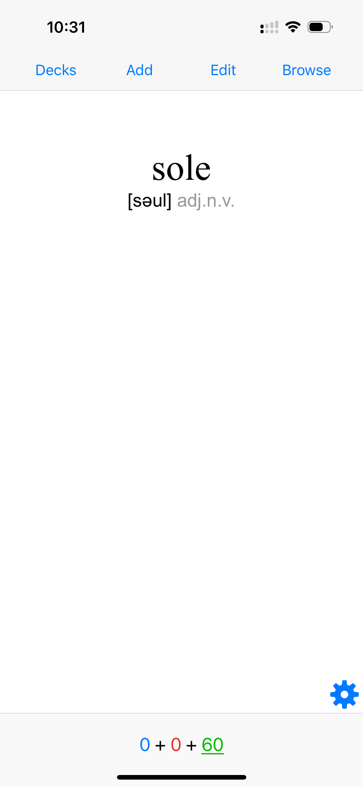
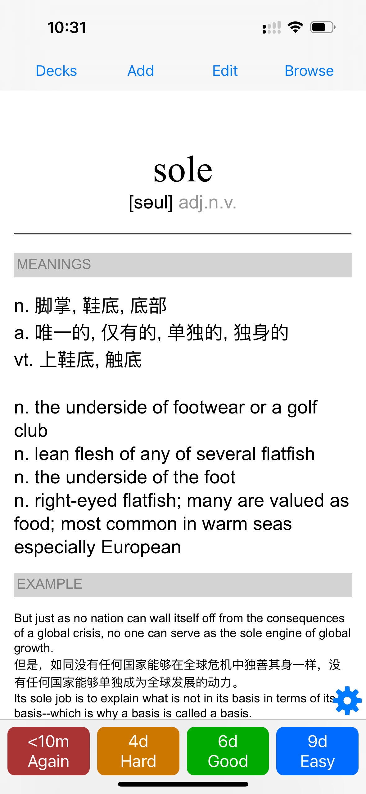
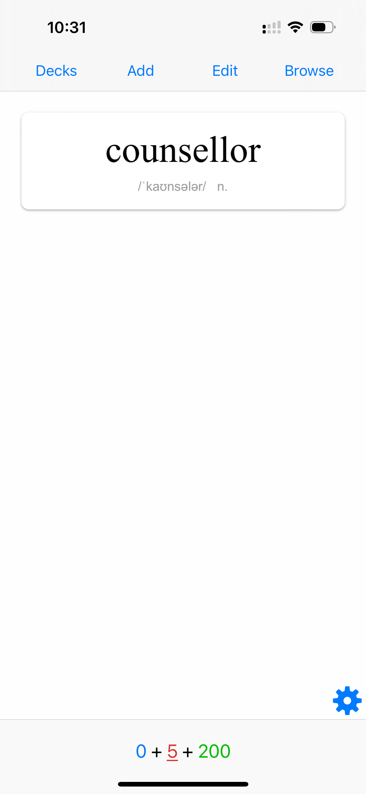
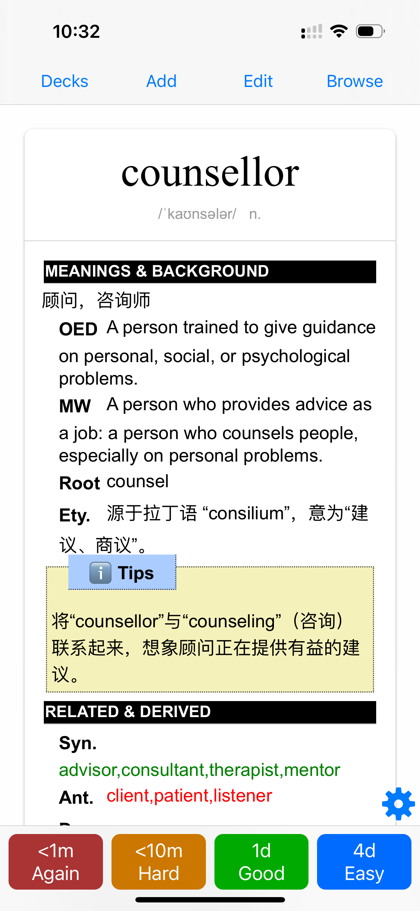

## TinyCard

This is a repository to contain tools and data for learning English for myself.

#### Features List
- ChatGPT based tool to extract relevant information for specified English word(You need to provide word list by you self).
```bash
├── config.py           ## config file, need to copy from config_sample.py and provide api key for ChatGPT before use
├── config_sample.py    ## sample of config file
├── main.py             ## main function
├── schema.sql          ## SQL schema to store the result into MySQL table tc_words
```

- `anki_web.html` : Normal layout for anki application. The layout result is like:



- `anki_web_gpt.html` : Customized layout for anki application. The final layout is like:



> This style is based on `Carlos Bonadeo`'s [Anki Material Flashcard](https://github.com/cdmoro/anki-material-flashcard).' Special thanks to him or her. :)
